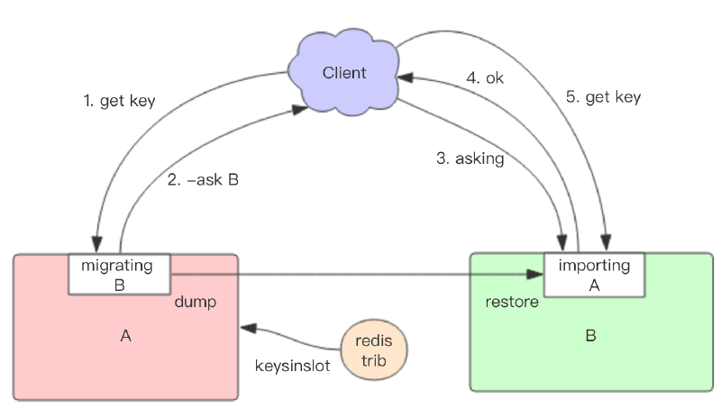

# redis cluster
Redis cluster是去中心化的集群。每个节点负责整个集群的一部分数据。
- Redis Cluster 将所有数据划分为 16384 的 slots，每个节点负责其中一部分槽位。
- Redis Cluster 的每个节点会将集群的配置信息持久化到配置文件中。

## 槽位定位算法
对 key 值使用 crc32 算法进行 hash 得到一个整数值，然后用这个整数值对 16384 进行取模来得到具体槽位。
```
crc16(key) % 16384
```
> 还可以通过在 key 字符串里面嵌入 tag 标记，可以强制 key 所挂在的槽位等于 tag 所在的槽位。

## 跳转
```
GET x
-MOVED 3999 127.0.0.1:6381
```
第一个参数 3999 是 key 对应的槽位编号，后面是目标节点地址。

## 迁移


> Redis Cluster 提供了工具 redis-trib

Redis 迁移的单位是槽，当一个槽正在迁移时，这个槽就处于中间过渡状态。
这个槽在原节点的状态为migrating，在目标节点的状态为importing，表示数据正在从源流向目标。

每个 key 的迁移过程描述：从源节点获取内容 => 存到目标节点 => 从源节点删除内容
1. 以原节点作为目标节点的「客户端」，原节点对当前key执行dump得到序列化内容，通过「客户端」向目标节点发送指令restore携带序列化的内容作为参数
2. 目标节点进行反序列化将内容恢复到目标节点的内存中，然后返回「客户端」OK，
3. 原节点「客户端」收到后把当前节点的key删除掉。

## 槽位迁移感知
Cluster 有两个特殊的 error 指令，一个是 moved，一个是 asking
- moved 用来纠正槽位
- asking 指令用来临时纠正槽位

## 集群变更感知
两种情况
- 目标节点挂掉，客户端抛出ConnectionError，会随机挑一个节点来重试，被重试的节点会通过 moved error 告知目标槽位被分配到的新的节点地址。
- DevOps手动修改了集群信息，将 master 切换到其它节点，并将旧的 master 移除集群。
这时去往旧节点上的指令会收到一个 ClusterDown 的错误，告知当前节点所在集群不可用。
客户端会关闭所有的连接，清空槽位映射关系表，然后向上层抛错。待下一条指令过来时，就会重新尝试初始化节点信息。