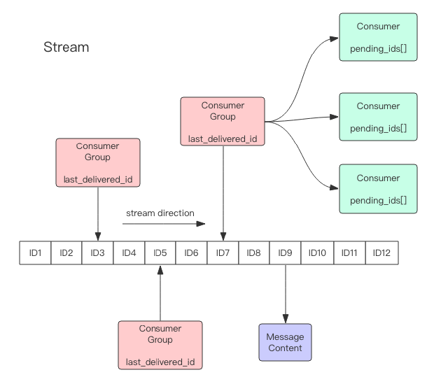

# redis stream
Redis5.0 新增了 Stream 数据结构，是一个新的强大的支持多播的可持久化的消息队列。



解析：
- 首先stream是一个链表，表示一系列消息。每个消息有一个唯一ID。
  - stream 通过首次使用 xadd 指令追加消息时自动创建
- 每个 Stream 都可以挂多个消费组，每个消费组有个游标last_delivered_id在 Stream 数组之上往前移动，表示当前消费组的消费位置。
  - 消费组 通过 xgroup create 指令创建，需要指定从 Stream 的某个消息 ID 开始消费，这个 ID 用来初始化last_delivered_id变量。
- 每个消费组 (Consumer Group) 独立，相互不受影响。
- 同一个消费组 (Consumer Group) 可以挂接多个消费者 (Consumer)，这些消费者之间是竞争关系，
任意消费者读取了消息都会使游标last_delivered_id往前移动。每个消费者有一个组内唯一名称。
- 消费者 (Consumer) 内部有个状态变量pending_ids，记录了当前已经被客户端读取的消息，但是还没有 ack。
如果客户端没有 ack，这个变量里面的消息 ID 会越来越多，一旦某个消息被 ack，它就开始减少。
- 消息 ID 形式是timestampInMillis-sequence，例1527846880572-5，表示在毫米时间戳1527846880572产生，并且是该毫秒内产生的第 5 条消息。
- 消息内容键值对。

## 增删改查
```
xadd 追加消息
xdel 删除消息，这里的删除仅仅是设置了标志位，不影响消息总长度
xrange 获取消息列表，会自动过滤已经删除的消息
xlen 消息长度
del 删除 Stream
```
示例
```
# * 号表示服务器自动生成 ID，后面跟key/value对
xadd s1 * name alice age 12

xlen s1

# -表示最小值 , + 表示最大值
xrange s1 - +

xdel s1 1527849609889-0
# len 不受影响
xlen s1

# 删除整个 Stream
del s1
```
